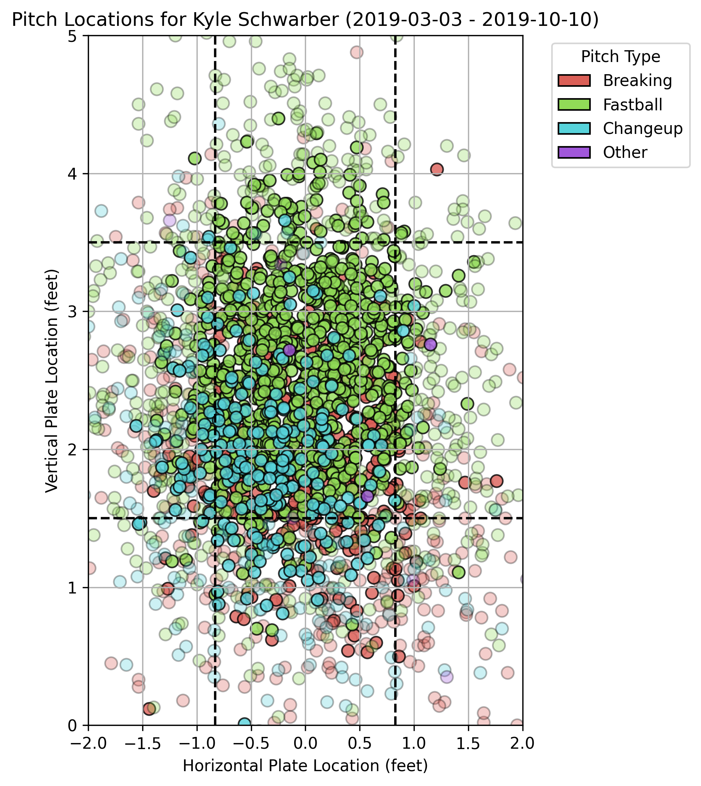

# 🧢 Clutch Player Project

I need a project to work on and I know baseball pretty well. I'm trying to create something where I can measure someone's "clutchness" in baseball. I have a hypothesis that even though stats may be similar, players like Harper and Schwarber are much more clutch than players like Castellanos. It seems obvious in this example since those are 2 of the best hitters in the league, but the point is there are players I'd much rather have up when I need a hit (even in non-high-impact situations, but where emotionally we need a hit), and it doesn't need to be someone with a .280 average if that person doesn't measure as clutch. There will probably be an analysis here of whether the metric correlates with batting average. The goal is to find undervalued players a la Moneyball, but also to validate it by showing that the top players are at the top.

## 🔍 Features

Right now it's just an input for the batter and year, and it returns a .png of the pitches they saw that year.

(ChatGPT):
- Pulls Statcast pitch-by-pitch data using `pybaseball`
- Filters for high-leverage clutch scenarios (e.g. RISP, 2 outs, late innings)
- Visualizes pitch locations on a strike zone plot
- Calculates hard-hit rate in clutch vs overall

## 📊 Example Output

Here’s an example strike zone plot for Shohei Ohtani:



## 📦 Requirements

- Python 3.9+
- `pybaseball`
- `pandas`
- `matplotlib`

Install dependencies:

```bash
pip install -r requirements.txt
